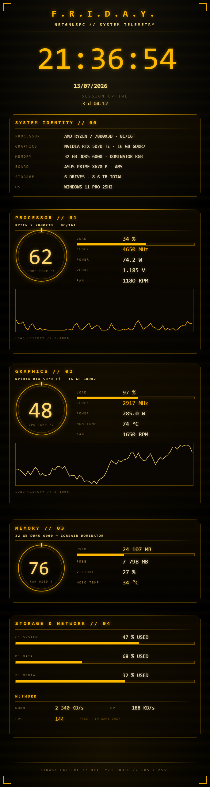
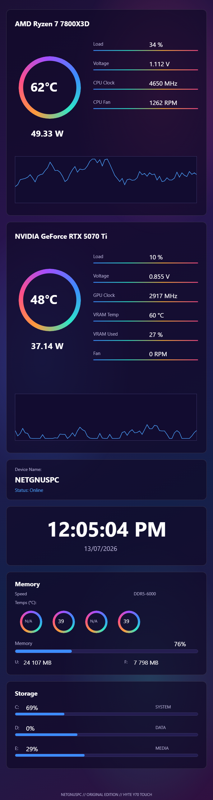
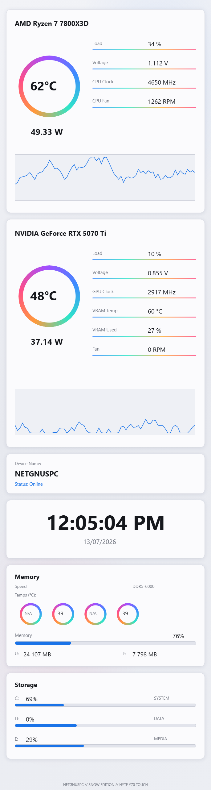
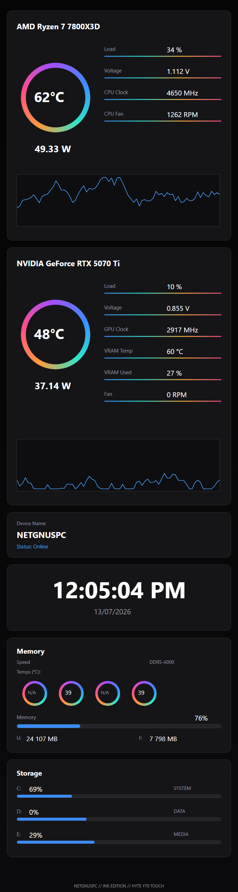

# Y70 Sensor Panels

AIDA64 SensorPanel skins for the **HYTE Y70 Touch** case display (685 × 2560), built for NETGNUSPC
(Ryzen 7 7800X3D · RTX 5070 Ti · 32 GB DDR5-6000). Every `.sensorpanel` is in AIDA64's native
export format with the background art embedded — **SensorPanel Manager → Import** and it just works.

All sensor IDs verified live against the machine via AIDA64 shared memory
(network = NIC3 / Intel AX200, vcore = `VCPU`, VRAM temp `TGPU1MEM` instead of the
hotspot sensor the RTX 50-series no longer has).

## Panels

| Panel | Look |
|---|---|
| [`friday-v2/`](friday-v2/) | F.R.I.D.A.Y. — gold-on-black Stark HUD, ring gauges for CPU/GPU temp + RAM %, load graphs, drives, network, FPS |
| [`skin-trio/Original/`](skin-trio/Original/) | Rainbow ring gauges on a purple nebula gradient |
| [`skin-trio/Snow/`](skin-trio/Snow/) | Same layout, clean light theme |
| [`skin-trio/Ink/`](skin-trio/Ink/) | Same layout, pure black |

### F.R.I.D.A.Y. v2

### Skin Trio — Original · Snow · Ink
  

## How they're made

Panels are generated by the scripts in [`generator/`](generator/):

1. A Python script lays out the design once, then renders the static art (frames, rings,
   labels, gradients) as HTML and screenshots it with headless Chrome → `background.png`.
2. The same layout data emits the `.sensorpanel` file — live values, bars and graphs as
   AIDA64 items positioned over the baked background, with the PNG hex-embedded in the file.

Notes on the (undocumented) `.sensorpanel` format: flat tag lines, one item per line;
colors are Windows COLORREF ints (`R + G<<8 + B<<16`); item types `LBL`, `[SIMPLE]<sensor>`,
`[GRAPH]<sensor>`, `[GAUGE]<sensor>`, and bare `<sensor>` for bar items; file encoding cp1252.

## Requirements

- AIDA64 Extreme or Engineer (SensorPanel needs a paid edition or the 30-day trial)
- RivaTuner Statistics Server running for the FPS readout (reads 0 outside games)
- Sensor IDs are rig-specific — on other machines, rebind items in SensorPanel Manager
  (especially NICx network rates and DIMM temp slots)
